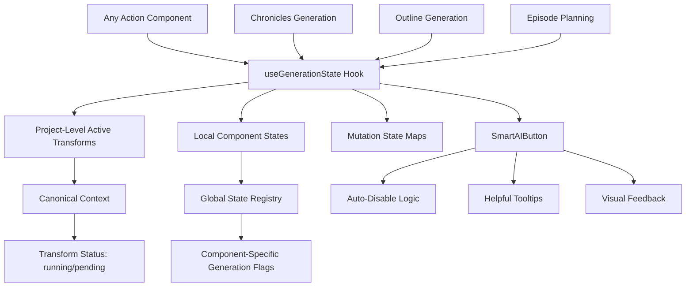

# Centralized Generation State System

This document describes the centralized system for managing generation states across all action buttons in the application, ensuring that when any jsondoc is in a generating state, all action buttons are automatically disabled.

## Overview

The system provides a unified approach to disable action buttons during generation, combining:

1. **Project-wide active transforms** (from `hasActiveTransforms` in canonical context)
2. **Local component generation states** (when user clicks but transform hasn't started yet)  
3. **Individual jsondoc mutation states** (from mutation state maps)

## Key Components

### 1. `useGenerationState` Hook

**Location**: `src/client/hooks/useGenerationState.ts`

The centralized hook that manages generation states across the application.

```typescript
const { 
  isAnyGenerating,      // True if ANY generation is happening (project-wide or local)
  isLocalGenerating,    // True if THIS component is generating locally
  setLocalGenerating,   // Set local generation state for this component
  getDisabledReason,    // Get human-readable reason for disabled state
  activeTransformTypes, // Array of active transform types
  hasActiveTransforms   // True if project has active transforms
} = useGenerationState('component-id');
```

### 2. `SmartAIButton` Component

**Location**: `src/client/components/shared/SmartAIButton.tsx`

Enhanced AI button that automatically disables during generation states.

```typescript
<SmartAIButton
  componentId="my-action-id"
  onClick={handleAction}
  generatingText="处理中..."
  loading={isLocalGenerating}
>
  执行操作
</SmartAIButton>
```

## Usage Examples

### Basic Action Component

```typescript
import { SmartAIButton } from '../shared';
import { useGenerationState } from '../../hooks/useGenerationState';

const MyActionComponent: React.FC<ActionProps> = ({ projectId, onSuccess, onError }) => {
  const [additionalInput, setAdditionalInput] = useState('');
  
  // Use centralized generation state
  const { isAnyGenerating, setLocalGenerating } = useGenerationState('my-action-id');
  
  const handleAction = async () => {
    setLocalGenerating(true);
    try {
      await apiService.performAction(projectId, additionalInput);
      onSuccess?.();
    } catch (error) {
      onError?.(error);
    } finally {
      setLocalGenerating(false);
    }
  };

  return (
    <div>
      {/* Input fields automatically disabled during any generation */}
      <input
        value={additionalInput}
        onChange={(e) => setAdditionalInput(e.target.value)}
        disabled={isAnyGenerating}
        placeholder={isAnyGenerating ? "生成中，请稍等..." : "输入内容"}
      />
      
      {/* Button automatically disabled during any generation */}
      <SmartAIButton
        componentId="my-action-id"
        onClick={handleAction}
        generatingText="处理中..."
      >
        执行操作
      </SmartAIButton>
    </div>
  );
};
```

### Advanced Usage with Manual Disabling

```typescript
<SmartAIButton
  componentId="outline-generation"
  onClick={handleGenerate}
  manuallyDisabled={!hasRequiredData || isFormInvalid}
  customDisabledReason="请先完成必填项目"
  generatingText="正在生成中..."
  allowClickDuringGeneration={false}  // Default: false
>
  生成大纲
</SmartAIButton>
```

## Benefits

### ✅ **Automatic Cross-Component Disabling**
- When any component starts generating, ALL action buttons are automatically disabled
- No more manual state coordination between components

### ✅ **Helpful User Feedback**
- Clear messages like "时间顺序大纲生成 生成中，生成完成后可编辑"
- Tooltips explain why buttons are disabled
- Visual styling changes (opacity, cursor) indicate disabled state

### ✅ **Simplified Component Code**
- No need to manually implement `isGenerating` state in each component
- No need to manually coordinate with other components
- Automatic input field disabling with generation-aware placeholders

### ✅ **Comprehensive State Tracking**
- Tracks project-wide transforms (running/pending status)
- Tracks local component states (button click → API call)
- Combines both for unified experience

### ✅ **Type Safe & Tested**
- Full TypeScript coverage with proper interfaces
- Comprehensive test suite covering all scenarios
- Mock-friendly for unit testing

## Migration from Old Pattern

### Before (Manual State Management):
```typescript
const [isGenerating, setIsGenerating] = useState(false);

const handleGenerate = async () => {
  setIsGenerating(true);
  try {
    await apiCall();
  } finally {
    setIsGenerating(false);
  }
};

<AIButton 
  disabled={isGenerating}
  loading={isGenerating}
  onClick={handleGenerate}
>
  {isGenerating ? '生成中...' : '生成内容'}
</AIButton>
```

### After (Centralized State Management):
```typescript
const { isAnyGenerating, setLocalGenerating } = useGenerationState('component-id');

const handleGenerate = async () => {
  setLocalGenerating(true);
  try {
    await apiCall();
  } finally {
    setLocalGenerating(false);
  }
};

<SmartAIButton 
  componentId="component-id"
  onClick={handleGenerate}
  generatingText="处理中..."
>
  生成内容
</SmartAIButton>
```

## System Architecture



## Testing

The system includes comprehensive tests:

- **Hook Tests**: `src/client/hooks/__tests__/useGenerationState.test.tsx`
- **Button Tests**: `src/client/components/shared/__tests__/SmartAIButton.test.tsx`
- **Integration Tests**: Updated existing component tests

Run tests with:
```bash
npm test -- --run src/client/hooks/__tests__/useGenerationState.test.tsx
npm test -- --run src/client/components/shared/__tests__/SmartAIButton.test.tsx
```

## Implementation Notes

### Global State Registry
- Uses a global `Map<string, boolean>` for cross-component state sharing
- Callbacks system ensures all components re-render when state changes
- Automatic cleanup on component unmount

### Performance
- Minimal re-renders through careful state management
- Memoized computations for expensive operations
- Global state changes only trigger updates in subscribed components

### Error Handling
- Graceful fallback when canonical context is pending/error
- Safe defaults for all state values
- Proper cleanup on component unmount/errors

This centralized approach ensures consistent UX across the entire application while dramatically simplifying component code and eliminating state coordination bugs.
