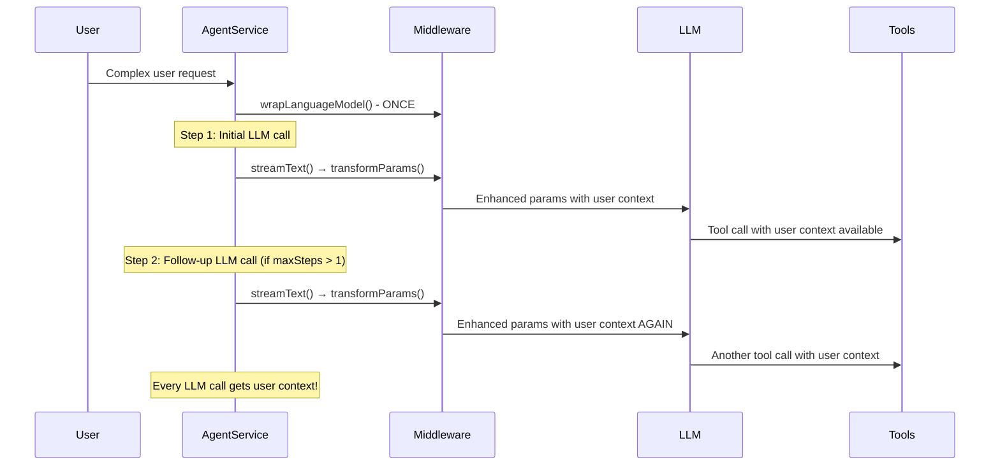

# User Context Middleware Solution

## Problem Statement

When using agents to call tools, there was an **information loss problem**: agents would relay only part of the user's request to tools (like `brainstorm_edit_patch`), not the full context. Tools would receive the agent's interpretation but lose the nuanced details from the original user message.

## Solution Overview

We implemented a **mechanical solution** using AI SDK's middleware system to automatically inject the original user request into all tool calls, ensuring tools have access to both:

1. **Agent's interpretation** (what the agent extracted/summarized)
2. **Original user request** (the full, unfiltered message)

## How It Works

### 1. Middleware Flow

```typescript
// User sends complex request
User: "Please edit my story to add romance and mystery elements, 
       make the pacing tighter, add a plot twist in act 2, 
       ensure it fits TikTok format with strong dramatic conflict..."

// Agent interprets and creates tools
Agent: editRequirements = "add romance and mystery elements"

// Middleware automatically injects FULL context into all LLM calls
Middleware: {
  originalUserRequest: "Please edit my story to add romance...", // FULL REQUEST
  agentInterpretation: "add romance and mystery elements"        // AGENT SUMMARY
}

// Tools receive BOTH contexts
Tool: Can now make decisions based on complete user intent
```

### 2. Implementation Components

#### A. User Context Middleware (`src/server/middleware/UserContextMiddleware.ts`)

```typescript
export function createUserContextMiddleware(contextOptions: UserContextOptions) {
    return {
        transformParams: async ({ params }) => {
            // Inject user context into ALL LLM calls
            return {
                ...params,
                providerMetadata: {
                    ...params.providerMetadata,
                    userContext: {
                        originalUserRequest: contextOptions.originalUserRequest,
                        projectId: contextOptions.projectId,
                        userId: contextOptions.userId,
                        timestamp: contextOptions.timestamp
                    }
                }
            };
        },
        // ... wrapStream and wrapGenerate methods
    };
}
```

#### B. Enhanced Agent Service (`src/server/transform-jsondoc-framework/AgentService.ts`)

```typescript
// Wrap the LLM model with middleware
const userContextMiddleware = createUserContextMiddleware({
    originalUserRequest: request.userRequest, // Full user message
    projectId,
    userId,
    timestamp: new Date().toISOString()
});

const enhancedModel = wrapLanguageModel({
    model: baseModel,
    middleware: userContextMiddleware
});

// Use enhanced model in streamText
const result = await streamText({
    model: enhancedModel, // Now injects context into every LLM call
    tools: tools,
    maxSteps: 25,
    prompt: completePrompt
});
```

#### C. Enhanced Tool Framework (`src/server/transform-jsondoc-framework/StreamingAgentFramework.ts`)

```typescript
export function createAgentTool<TInput, TOutput>(toolDef: StreamingToolDefinition<TInput, TOutput>) {
    return tool({
        description: toolDef.description,
        parameters: toolDef.inputSchema as any,
        execute: async (params: TInput, { toolCallId, messages }) => {
            // Extract user context from messages (injected by middleware)
            let userContext = null;
            for (let i = messages.length - 1; i >= 0; i--) {
                const message = messages[i] as any;
                if (message?.providerMetadata?.userContext) {
                    userContext = message.providerMetadata.userContext;
                    break;
                }
            }

            // Pass enhanced options to tool
            const result = await toolDef.execute(params, { 
                toolCallId, 
                messages, 
                userContext // Now available to all tools!
            });
            return result;
        }
    });
}
```

#### D. Enhanced Tool Implementation (Example: BrainstormEditTool)

```typescript
execute: async (params: BrainstormEditInput, { toolCallId, userContext }) => {
    // Now we have access to both contexts!
    if (userContext?.originalUserRequest) {
        console.log(`Original user request: "${userContext.originalUserRequest}"`);
        console.log(`Agent interpreted as: "${params.editRequirements}"`);

        // Use BOTH in template preparation
        const enhancedEditRequirements = `
用户原始完整请求: "${userContext.originalUserRequest}"

代理解释的编辑要求: "${params.editRequirements}"

请根据用户的原始完整请求进行编辑，而不仅仅是代理的解释。`;

        // Pass to template...
    }
}
```

### 3. When Middleware Gets Called

The middleware intercepts **every LLM call**, not just tool calls:



## Benefits

1. **Preserves Full Context**: Tools receive both agent interpretation AND original user request
2. **Mechanical Implementation**: Uses AI SDK's built-in middleware system - no manual intervention
3. **Minimal Code Changes**: Existing tools work unchanged, with optional access to enhanced context
4. **Backward Compatible**: No breaking changes to existing functionality
5. **Debugging Friendly**: Clear logging of context injection and usage

## Usage Example

```bash
# Test the implementation
./run-ts src/server/scripts/test-user-context-middleware.ts
```

The test demonstrates:
- ✅ Middleware injecting user context into all LLM calls
- ✅ Tools receiving both agent interpretation AND original user request  
- ✅ Tools making decisions based on full context
- ✅ Information loss problem solved mechanically

## Key Files Modified

- `src/server/middleware/UserContextMiddleware.ts` - New middleware implementation
- `src/server/transform-jsondoc-framework/AgentService.ts` - Wrap model with middleware
- `src/server/transform-jsondoc-framework/StreamingAgentFramework.ts` - Extract context in tools
- `src/server/tools/BrainstormTools.ts` - Example enhanced tool implementation

## Conclusion

This solution provides a **mechanical, code-level way** to ensure tools always have access to the user's original, unfiltered request alongside the agent's interpretation. It solves the information loss problem without requiring manual changes to individual tools, using the AI SDK's built-in middleware capabilities. 