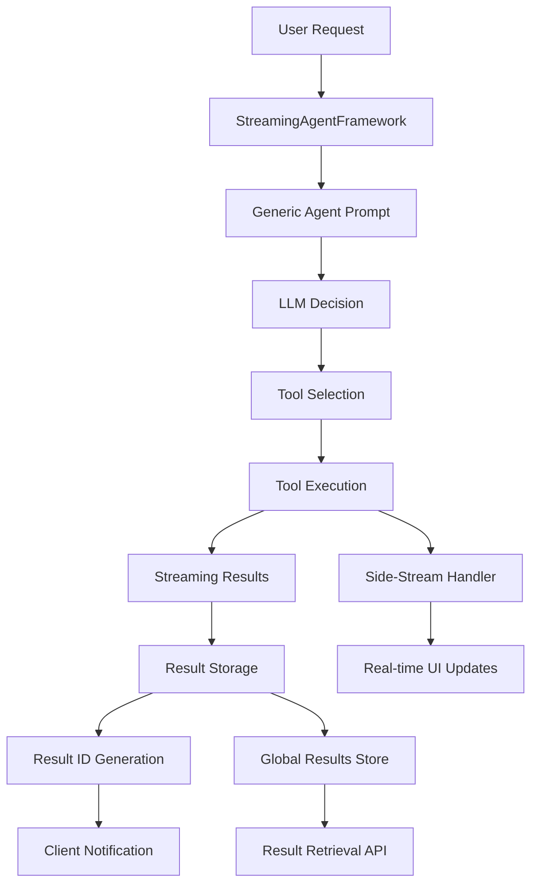
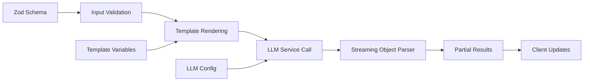

# Streaming Agent Architecture

## Overview

The Script Writer application features a **Streaming Agent Framework** that enables AI agents to use specialized tools for content generation. This architecture provides a flexible, extensible system for creating AI-powered workflows with real-time streaming capabilities.

## Core Components

### 1. StreamingAgentFramework.ts

The central orchestrator that manages agent execution, tool registration, and result streaming.

#### Key Features
- **Generic Tool System**: Supports any tool that implements the `StreamingToolDefinition` interface
- **Real-time Streaming**: Provides live updates during tool execution
- **Result Management**: Global in-memory storage with unique result IDs
- **Error Handling**: Comprehensive error recovery and logging
- **Multi-step Execution**: Supports complex workflows with multiple tool calls

#### Core Interfaces

```typescript
interface StreamingToolDefinition<TInput, TOutput> {
  name: string;
  description: string;
  inputSchema: z.ZodSchema<TInput>;
  outputSchema: z.ZodSchema<TOutput>;
  executeFunction: (input: TInput) => Promise<AsyncIterable<Partial<TOutput>>>;
}

interface StreamingAgentConfig {
  userRequest: string;
  toolDefinitions: StreamingToolDefinition<any, any>[];
  maxSteps?: number;
  onStreamChunk?: (chunk: any) => void;
  onResultId?: (resultId: string) => void;
}
```

#### Architecture Flow



### 2. Tool System

#### BrainstormTool.ts

A concrete implementation of the streaming tool interface for content brainstorming.

```typescript
export function createBrainstormToolDefinition(): StreamingToolDefinition<IdeationInput, IdeationOutput> {
  return {
    name: 'brainstorm',
    description: 'Generates creative story ideas based on platform and genre',
    inputSchema: IdeationInputSchema,
    outputSchema: IdeationOutputSchema,
    executeFunction: executeStreamingIdeationTransform,
  };
}
```

#### Tool Registration Pattern

Tools are registered with the agent framework and can be dynamically selected based on user requests:

```typescript
const brainstormToolDef = createBrainstormToolDefinition();
const result = await runStreamingAgent({
  userRequest,
  toolDefinitions: [brainstormToolDef],
  maxSteps: 3,
  onStreamChunk: handleStreamChunk,
  onResultId: handleResultId
});
```

### 3. Transform System

#### ideation-stream.ts

Implements the actual business logic for content generation with streaming capabilities.

#### Key Features
- **Input Validation**: Uses Zod schemas for type-safe input validation
- **Template Rendering**: Dynamic prompt generation with variable interpolation
- **LLM Integration**: Streams partial objects from language models
- **Error Recovery**: Handles streaming errors gracefully

#### Transform Flow



#### Template System

```typescript
function renderTemplate(template: string, variables: Record<string, string>): string {
  let rendered = template;
  for (const [key, value] of Object.entries(variables)) {
    rendered = rendered.split(`%%${key}%%`).join(value);
  }
  // Validation for unresolved variables
  const unresolvedMatches = rendered.match(/%%([^%]+)%%/g);
  if (unresolvedMatches) {
    throw new Error(`Template contains unresolved variables: ${unresolvedMatches.join(', ')}`);
  }
  return rendered;
}
```

## Agent Execution Flow

### 1. Request Processing

```typescript
// User makes request with natural language
const userRequest = "I need to create story ideas for TikTok videos. The genre should be time travel and power fantasy...";

// Agent analyzes request and selects appropriate tool
const result = await runStreamingAgent({
  userRequest,
  toolDefinitions: [brainstormToolDef],
  maxSteps: 3
});
```

### 2. Tool Selection & Execution

The agent uses an LLM to:
1. **Analyze** the user request
2. **Select** the most appropriate tool
3. **Extract** necessary parameters
4. **Execute** the tool with streaming
5. **Return** result IDs for retrieval

### 3. Streaming & Results

- **Real-time Updates**: Clients receive partial results as they're generated
- **Result Storage**: Final results stored with unique IDs
- **Retrieval API**: Results can be fetched later using result IDs

## API Integration

### Streaming Endpoint

```typescript
router.post('/agent/stream', authMiddleware.authenticate, async (req, res) => {
  // Set up SSE headers
  res.writeHead(200, {
    'Content-Type': 'text/event-stream',
    'Cache-Control': 'no-cache',
    'Connection': 'keep-alive'
  });

  // Run streaming agent
  const result = await runStreamingAgent({
    userRequest: validatedInput.userRequest,
    toolDefinitions: [brainstormToolDef],
    onStreamChunk: ({ chunk }) => {
      res.write(`data: ${JSON.stringify({ type: 'chunk', data: chunk })}\n\n`);
    },
    onResultId: (resultId) => {
      res.write(`data: ${JSON.stringify({ type: 'resultId', resultId })}\n\n`);
    }
  });
});
```

### Result Retrieval

```typescript
router.get('/results/:resultId', authMiddleware.authenticate, (req, res) => {
  const result = getResultById(req.params.resultId);
  if (!result) {
    return res.status(404).json({ error: "Result not found" });
  }
  res.json({ resultId, data: result });
});
```

## Testing & Development

### test-agent-flow.ts

Provides a complete testing environment for the agent system:

```typescript
async function main() {
  const brainstormToolDef = createBrainstormToolDefinition();
  
  const result = await runStreamingAgent({
    userRequest: "Create story ideas for TikTok videos...",
    toolDefinitions: [brainstormToolDef],
    maxSteps: 3,
    onStreamChunk: ({ chunk, chunkCount }) => {
      logUpdate(`[Chunk ${chunkCount}]\n${JSON.stringify(chunk, null, 2)}`);
    },
    onResultId: (resultId) => {
      console.log(`Generated result ID: ${resultId}`);
    }
  });
}
```

## Architecture Benefits

### 1. Modularity
- **Pluggable Tools**: Easy to add new capabilities
- **Reusable Components**: Transform logic can be shared
- **Clear Separation**: Framework, tools, and transforms are decoupled

### 2. Scalability
- **Streaming Architecture**: Handles large responses efficiently
- **Memory Management**: Results stored with automatic cleanup
- **Concurrent Execution**: Multiple agents can run simultaneously

### 3. Developer Experience
- **Type Safety**: Full TypeScript support with Zod validation
- **Testing Framework**: Built-in testing and debugging tools
- **Comprehensive Logging**: Detailed execution traces

### 4. User Experience
- **Real-time Feedback**: Users see progress as it happens
- **Reliable Results**: Persistent storage with unique IDs
- **Error Recovery**: Graceful handling of failures

## Extension Points

### Adding New Tools

1. **Create Tool Definition**:
```typescript
export function createMyToolDefinition(): StreamingToolDefinition<MyInput, MyOutput> {
  return {
    name: 'mytool',
    description: 'Description of what the tool does',
    inputSchema: MyInputSchema,
    outputSchema: MyOutputSchema,
    executeFunction: executeMyTransform,
  };
}
```

2. **Implement Transform Logic**:
```typescript
export async function executeMyTransform(input: MyInput) {
  const validatedInput = MyInputSchema.parse(input);
  // Transform logic here
  return partialObjectStream;
}
```

3. **Register with Agent**:
```typescript
const myToolDef = createMyToolDefinition();
const result = await runStreamingAgent({
  userRequest,
  toolDefinitions: [brainstormToolDef, myToolDef],
  // ... other config
});
```

### Extending the Framework

- **Custom Result Storage**: Replace in-memory storage with database
- **Advanced Routing**: Add tool selection strategies
- **Monitoring**: Add metrics and performance tracking
- **Security**: Implement tool-level permissions

## Security Considerations

### 1. Authentication
- All agent endpoints require authentication
- User context passed to all tool executions
- Results scoped to authenticated users

### 2. Input Validation
- Zod schemas validate all inputs
- Template rendering prevents injection attacks
- LLM prompts sanitized and validated

### 3. Resource Management
- Result storage with automatic cleanup
- Streaming timeouts and cancellation
- Memory usage monitoring

## Performance Characteristics

### 1. Streaming Benefits
- **Immediate Feedback**: Users see results as they're generated
- **Memory Efficient**: Processes large responses incrementally
- **Cancellable**: Operations can be stopped mid-stream

### 2. Scalability Features
- **Stateless Design**: Framework doesn't hold persistent state
- **Concurrent Safe**: Multiple agents can run simultaneously
- **Resource Bounded**: Built-in limits prevent resource exhaustion

## Future Enhancements

### 1. Advanced Agent Capabilities
- **Multi-tool Workflows**: Agents that use multiple tools in sequence
- **Conditional Logic**: Tools that branch based on intermediate results
- **Feedback Loops**: Agents that refine results based on user feedback

### 2. Enhanced Streaming
- **Partial Result Validation**: Stream-aware schema validation
- **Progress Tracking**: More granular progress indicators
- **Resume Capability**: Ability to resume interrupted streams

### 3. Integration Features
- **Database Integration**: Persistent result storage
- **Webhook Support**: Notify external systems of completions
- **Batch Processing**: Handle multiple requests efficiently

## Conclusion

The Streaming Agent Framework provides a robust foundation for AI-powered content generation with real-time streaming capabilities. Its modular design, comprehensive error handling, and developer-friendly APIs make it suitable for both simple use cases and complex multi-step workflows.

The architecture successfully balances flexibility with performance, providing a solid foundation for future enhancements and extensions. 